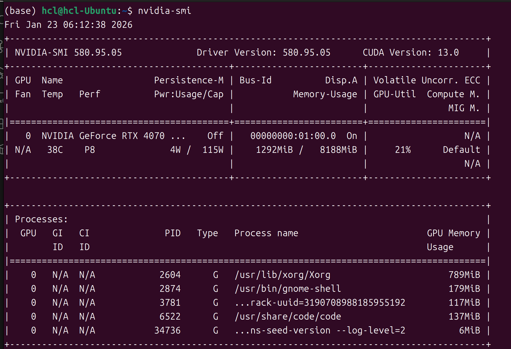
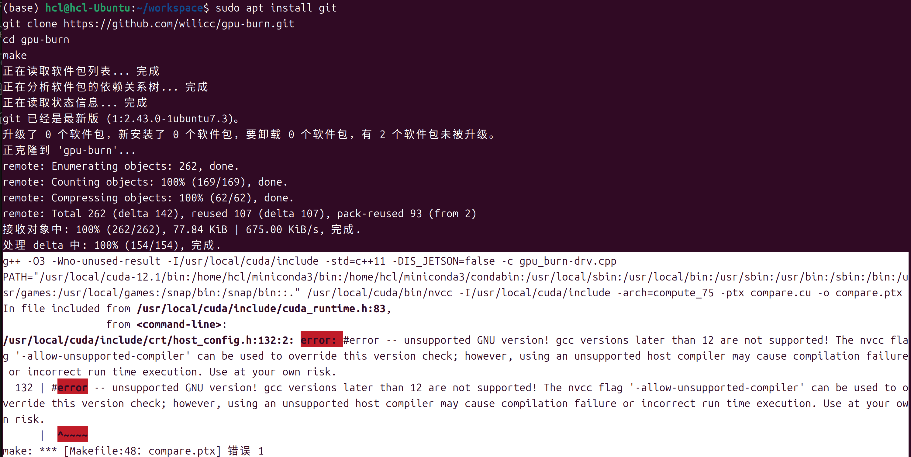

本文基于本人的经验书写，如有错漏或优化欢迎指正！

本人机器环境：  
Lenovo Legion Y7000p 2024 (IRX9)（ 联想拯救者 Y7000p 2024 (IRX9) ）  
Ubuntu 24.04  
CPU:  Intel(R) Core(TM) i7-14700HX  
RAM： 32GB DDR5 5600MT/s (双通道)  
    插槽 1: 16GB - Ramaxel (记忆科技)  
    插槽 2: 16GB - SK Hynix (SK 海力士)  
GPU: NVIDIA GeForce RTX 4070 Laptop GPU (8GB GDDR6)

## CPU 烤机

1. 安装监视器

    在 Linux 中，没有类似于 `Windows任务管理器` 那种系统集成的硬件监视器可以为我们提供便利的可视化界面，因此我们需要自己安装。

    ```bash
    sudo apt update && sudo apt install s-tui
    ```

    `s-tui` 是一个在终端打开并显示的 CPU和温度 的监视器，在下载 `stress` 后，也可以用来一键烤机。

2. 安装烤机软件

    ```bash
    sudo apt install stress    # 基础烤机软件
    sudo apt install stress-ng # 更完善的烤机软件，功能更加强大
    ```

3. 开烤！

    先把监视器打开

   ```bash
   # 使用 sudo 打开可以监控 CPU,电源和功耗
   # 不使用 sudo 打开仅能监控 CPU 
    sudo s-tui  
   ```

   现在原本的终端窗口会被监控器占用，但是没关系，我们可以**打开另一个终端窗口**来开始烤机

    ```bash
    stress-ng \
        --cpu 28 \
        --cpu-method matrixprod \
        --vm 1 \
        --vm-bytes 80% \
        --metrics-brief \
        --timeout 600s
    ```

    参数详细说明：  
    --cpu 28: 调用 i7-14700HX 全部 28 个逻辑线程。  
    --cpu-method matrixprod: 使用矩阵乘法算法，这是压榨 CPU 功耗和热量最有效的方法。  
    --vm 1 --vm-bytes 80%: 启动 1 个内存压测进程，占用约 80% 内存，验证 DDR5 5600MT/s 内存稳定性。  
    --metrics-brief: 测试结束后输出简要的性能总结（包含 bogo ops/s 指标）。  
    --timeout 60s: 设定测试时长为 600 秒。

## GPU 烤机

仅适用于 `Nvidia` 显卡且安装的是官方驱动

1. 确认驱动和 CUDA 是否安装

    如果前面已经打开了 CPU 的烤机程序，那个终端会被占用。请打开一个新的终端执行以下操作。

    ```bash
    nvidia-smi
    ```

    如果有类似如图的信息，那么说明显卡驱动是正确的，可以进行下一步  
    

    ```bash
    nvcc -V
    ```

    如果有类似如图的信息，那么说明 CUDA 已经安装，可以进行下一步  
    

2. 安装监视器

    ```bash
    sudo apt install nvtop # 用于监控显卡的占用和功耗等信息
    ```

3. 安装烤机工具

    ```bash
    sudo apt install git 
    git clone https://github.com/wilicc/gpu-burn.git
    cd gpu-burn
    make
    ```

    如果发生了如图错误  
      
    说明是你的 gcc/g++ 版本或 Ubuntu 版本过高，需要手动下载旧版本并使用旧版本编译

    ```bash
    # 下载旧版本的 gcc/g++ 编译器
    sudo apt install gcc-12 g++-12

    # 重新编译
    make clean
    make NVCC="/usr/local/cuda/bin/nvcc -ccbin g++-12"
    ```

4. 开考！！

    先把监视器打开

   ```bash
   nvtop
   ```

   现在原本的终端窗口会被监控器占用，但是没关系，我们可以**打开另一个终端窗口**来开始烤机

    ```bash
    ./gpu-burn 600  # 烤 600s 
    ```

5. 完成～ 只需要静静等待就可以了～

## 可能出现的问题及处理方案

### 拯救者的能耗模式切换

只能使用预设的 `安静模式` `通用模式` `野兽模式`！！  

任何自定义模式，包括 `超能模式` 都会影响 Ubuntu 系统的功耗判定导致锁功耗！！  
哪怕在 Windows 端通过 `Lenovo Zone` 设置好了也没有用。只能用这三个预设

### Nvidia powerd 显卡功耗控制 （解决 Nvidia GPU 功耗墙问题）

本博主之前使用的是 `Nvidia-driver-580-open` 官方开源驱动，没有`Nvidia Powerd`功能，需要在 Ubuntu 初始自带的 `软件和更新`(`Software and Update`) 中更新为 `Nvidia-diver-580` 官方闭源驱动，才有这个功能。

#### 检查驱动版本

```bash
cat /proc/driver/nvidia/version
```

检查输出是否存在 **`open`** 字样。如果存在，则是开源版，不存在则是闭源版本

#### 更新驱动版本

在 Ubuntu 自带的 `软件和更新`(`Software and Update`) 中更新为 `Nvidia-diver-580` （注意寻找不带 **open-kernal** 字样的）官方闭源驱动。
